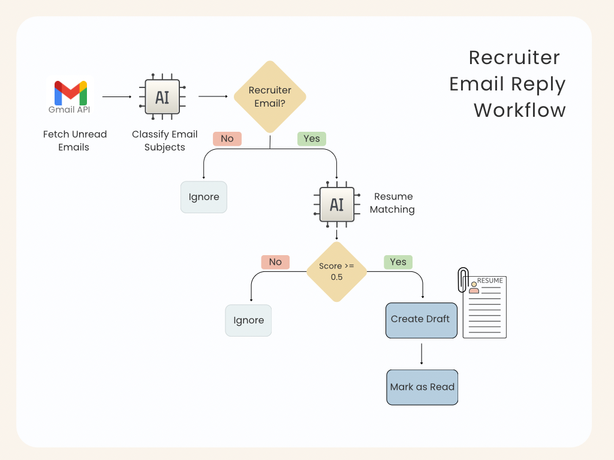

# Recruiter Email Reply Workflow

AI-powered workflow that automatically classifies recruiter emails, checks if your resume aligns with the job description using semantic similarity, and drafts a reply with your resume attached. Built using Gmail API, a fine-tuned DistilBERT classifier, and SentenceTransformer embeddings.

## Features

- 🤖 **AI-Powered Classification**  
  Fine-tuned **DistilBERT** model classifies recruiter emails with over 90% accuracy.

- 🧠 **Resume Matching with Job Description**  
  Compares your full resume content against the recruiter's email/job description using **semantic similarity** (via `SentenceTransformers`). Replies are only drafted if the match is strong enough.

- 📧 **Draft Replies**  
  Creates polite draft replies using a pre-written message template — with your resume (resume.pdf) attached.


- 🔄 **Gmail API Integration**  
  Reads unread emails, processes them, and marks them as read using the Gmail API.

- 📜 **Logging for Transparency**  
  Logs detailed messages for each step of the pipeline to help with debugging and transparency.


## Example Output

```
python mail_automation.py

2025-07-14 16:14:46,759 - INFO - Load pretrained SentenceTransformer: all-MiniLM-L6-v2
2025-07-14 16:14:50,753 - INFO - file_cache is only supported with oauth2client<4.0.0
2025-07-14 16:14:51,484 - INFO - Loaded fine-tuned model from ./fine_tuned_model
2025-07-14 16:14:51,754 - INFO - Found 2 unread emails
2025-07-14 16:14:51,914 - INFO - Classification result: non-recruiter for 'You have 1 new message'
2025-07-14 16:14:51,914 - INFO - Skipping NON-RECRUITER email: You have 1 new message
2025-07-14 16:14:52,464 - INFO - Classification result: recruiter for 'Software Development Engineer in Test || Location: San Diago/Carlsbad, CA || Only W2'
Batches: 100%|██████████████████████████████████████████| 1/1 [00:00<00:00,  9.33it/s]
Batches: 100%|██████████████████████████████████████████| 1/1 [00:00<00:00, 23.04it/s]
2025-07-14 16:14:52,685 - INFO - Resume-Job semantic similarity score: 0.609
2025-07-14 16:14:52,685 - INFO - High semantic match – creating draft for RECRUITER email: Software Development Engineer in Test || Location: San Diago/Carlsbad, CA || Only W2
2025-07-14 16:14:53,537 - INFO - Created draft for RECRUITER email: Software Development Engineer in Test || Location: San Diago/Carlsbad, CA || Only W2

```
##  Tech Stack
- Python 3.8+
- Hugging Face Transformers
- PyTorch (CPU-compatible)
- Gmail API (Google Cloud)
- SentenceTransformers (all-MiniLM-L6-v2) for resume-job similarity
- scikit-learn (for evaluation metrics)
- PyMuPDF (for PDF resume parsing)

## Project Structure
```
MailAIWorkflow/
├── assets/
│   └── resume.pdf                 
├── credentials/
│   ├── credentials.json          # Google OAuth
│   └── token.json                # Generated token
├── src/
│   ├── auth.py                   # Gmail OAuth
│   ├── classifier.py             # Email subject classifier
│   ├── gmail_client.py           # Gmail API utilities
│   ├── mail_automation.py        # Main script
│   ├── fine_tuned_model/         # Fine-tuned DistilBERT weights
│   ├── semantic_matcher.py       # Resume-job matching 
│   └── skills_matcher.py          
├── requirements.txt              # Python dependencies
└── README.md
```

## Model Fine-Tuning

The DistilBERT model was fine-tuned on a labeled dataset of recruiter and non-recruiter email subjects.

- Dataset:  
  100+ manually labeled subjects (50/50 recruiter/non-recruiter)
- Accuracy: 92% on the validation set
- Training Time: ~15 minutes (on Intel UHD 620 CPU)


**Note:** The email classification model has been fine-tuned specifically for identifying recruiter emails related to Software Development Engineer in Test (SDET), QA Automation Engineer, or similar roles.

## Fine-Tune with Your Own Data
Want to adapt this project for your specific job role. You can fine-tune the classifier with your own labeled email subjects.

Step 1: Prepare Your Dataset
Create a simple CSV file  with two columns:
```
subject,label
"Urgent: SDET Position at Google",1
"Your Monthly Newsletter from ABC",0
```
You can start with as few as 100–500 rows.

Step 2: Run the Training
```
cd src
python train_model.py
```
What this does:
- Loads your dataset
- Fine-tunes DistilBERT on CPU
- Logs training progress and accuracy
- Saves the final model to ./fine_tuned_model/

Step 3: Use Your New Model
Update mail_automation.py to load your fine-tuned model:
## Load fine-tuned model
```
classifier = Classifier(fine_tune_path="./fine_tuned_model")
```
That’s it — your custom classifier is now live!

## How Resume Matching Works
- Extracts full resume text from PDF (using PyMuPDF)
- Extracts recruiter job description from email body
- Generates semantic embeddings for both (using SentenceTransformers)
- Computes cosine similarity
- Only drafts reply if similarity score ≥ 0.5 (configurable)

## Getting Started
1. Clone the Repository
```
git clone https://github.com/yourusername/MailAIWorkflow.git
cd MailAIWorkflow
```
2. Set Up Virtual Environment
```bash
python -m venv venv
```
Linux/Mac
```
source venv/bin/activate
```
Windows
```
venv\Scripts\activate
```

3. Install Dependencies
```
pip install -r requirements.txt
```

4. Gmail API Setup
- Enable Gmail API in Google Cloud Console
- Download credentials.json into the /credentials/ folder
- Run the auth script to generate token.json:
```
cd src
python auth.py
```

5. Add Your Resume
Place your resume as a PDF at:
```
assets/resume.pdf
```

## Run the Full Email Workflow
```
cd src
python mail_automation.py
```

## Feedback
I'd love to hear your thoughts!
 What workflows have you automated recently?
 How would you improve this one?
Feel free to open issues or share suggestions.

### Workflow Diagram



## 👨‍💻 Author
👤 Tasnim Fariyah
🔗 [Github](https://github.com/tfariyah31)
🔗 [LinkedIn](https://www.linkedin.com/in/tasnim-fariyah/)

